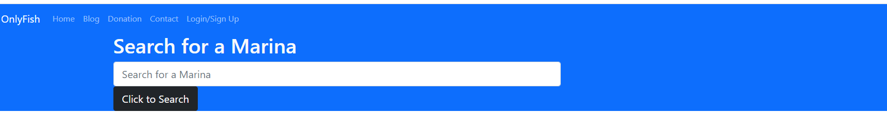

# Project 3: OnlyFish

## Overview

Projects have played a key role in your journey to becoming a full-stack web developer. As you apply for development jobs, your portfolio is absolutely vital to opening doors to opportunities. Your portfolio showcases high-quality deployed examples of your work, and you can use your finished projects for that very purpose.

This project is a fantastic opportunity to show employers your collaborative skills and coding abilities, especially in the context of a scalable, user-focused MERN app. Remember that employers want to see what you can do, but they also want to see how you work with other developers. The more examples of deployed collaborative work you have in your portfolio, the more likely you are to get an interview and a job.

## Group #5 Team Members:

#### [Saqueb Khan](https://github.com/SaquebKhan)
#### [Jorge Viera](https://github.com/Jorgevier)
#### [Jamie Kaczor](https://github.com/JamieKaczor)

## Technologies Used:
- HTML5
- CSS3
- Bootstrap CSS Framework
- Express
- GraphQL
- React
- MongoDB
- JWT
- Mongoose

## Key Topics

The following topics will be covered in this unit:

* Full-stack MERN applications

* [Git branching workflow](https://git-scm.com/book/en/v2/Git-Branching-Branching-Workflows)

* [Agile software development](https://en.wikipedia.org/wiki/Agile_software_development)

* Collaborative development

## Screenshot and Deployed Link

